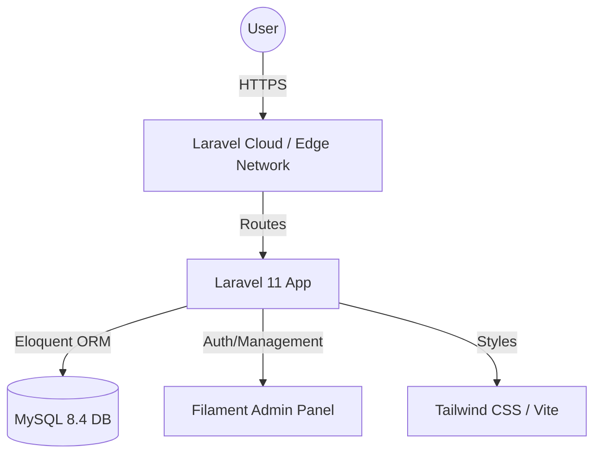
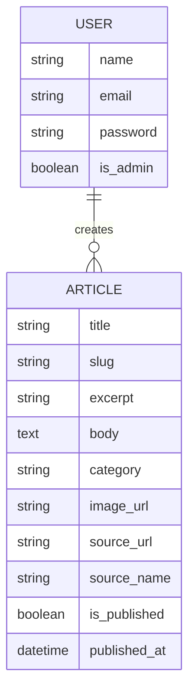
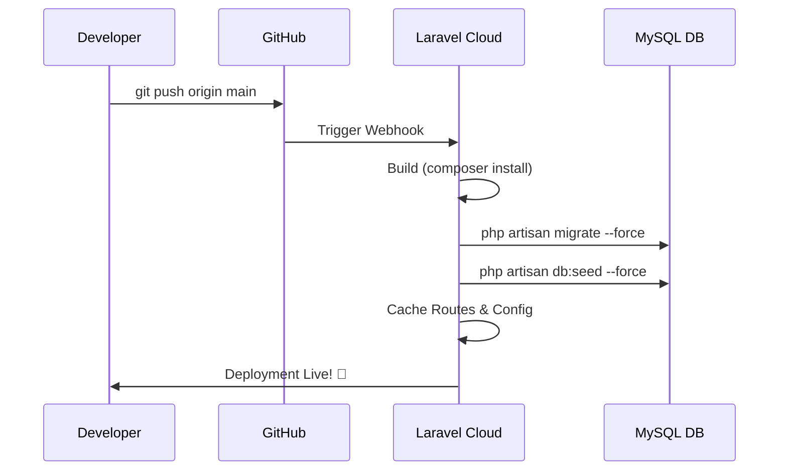

# 🤖 AI Now — The Future of AI, Delivered Daily


**AI Now** is a modern, high-performance news platform built with Laravel 11 and Filament PHP. It provides a sleek, glassmorphic interface for consuming the latest artificial intelligence news, research, and product updates.

---

## 🚀 System Architecture



## 📊 Database Schema (ERD)



---

## ✨ Key Features

- **💎 Premium UI/UX**: Dark mode by default with glassmorphism effects and modern typography (Inter/Outfit).
- **🛠️ Filament Admin**: A full-featured dashboard to manage articles, categories, and users at `/admin`.
- **📦 Production Ready**: Optimized for Laravel Cloud with shared database support and automated build commands.
- **⚡ Performance First**: Integrated caching for routes, config, and views, using database-driven sessions for stability.
- **🏷️ Smart Categorization**: Articles are grouped into AI News, Models, Research, and Tools.

---

## 🛠️ Local Setup & Running

### Prerequisites
- PHP 8.2+
- Composer
- Node.js & NPM
- MySQL

### Installation Steps

1. **Clone the repository**:
   ```bash
   git clone <your-repo-url>
   cd Laravel-proj
   ```

2. **Install Dependencies**:
   ```bash
   composer install
   npm install
   ```

3. **Environment Configuration**:
   ```bash
   cp .env.example .env
   php artisan key:generate
   ```
   *Edit `.env` and set your `DB_DATABASE`, `DB_USERNAME`, and `DB_PASSWORD`.*

4. **Run Migrations & Seeders**:
   ```bash
   php artisan migrate --seed
   ```

5. **Link Storage & Build Assets**:
   ```bash
   php artisan storage:link
   npm run dev
   ```

6. **Serve the Application**:
   ```bash
   php artisan serve
   ```
   Visit `http://localhost:8000` to see the site. Access the admin at `/admin` (Default: `admin@example.com` / `password`).

---

## ☁️ Laravel Cloud Deployment Flow



### Steps to Deploy
1. **Push to GitHub**: Initialize git and push to a new repo.
2. **Import Project**: Select the repo in Laravel Cloud.
3. **Provision Database**: Add a MySQL resource (Free Tier/Dev).
4. **Configure Build Command**:
   ```bash
   php artisan migrate --force && php artisan db:seed --force && php artisan config:cache && php artisan route:cache && php artisan view:cache && php artisan storage:link
   ```
5. **Set Environment Variables**: Add `APP_NAME`, `APP_ENV=production`, and your `NEWS_API_KEY`.
6. **Deploy**: Click the blue **Deploy** button and watch the magic happen!

---

## 📜 License
The AI Now platform is open-sourced software licensed under the [MIT license](https://opensource.org/licenses/MIT).

